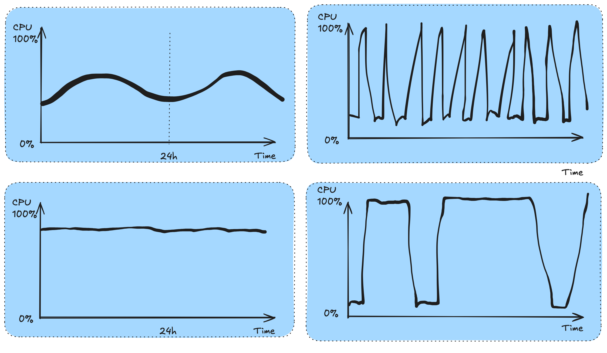

# Cloud Cost Optimization 
###  Marius Nygård 
Platform Engineer/DevOps Engineer @Crayon Consulting

<!-- Time Goal: 1:00 -->
<!-- 
.  at 0:00 Intro/goal/agenda                             
..      -> intro
..      problem context
..      goal
..      agenda

.  at 7:00 Context/what do?/how measure success?         
.  at 14:00 Instance selection                          
.  at 22:00 Workload profiling                     
.  at 30:00 Holistic optimization/ DAG analysis    
.  at 38:00 Summary
-->
---

# Problem Context

<div class="columns" style="font-size: 20px;">
  <div>

  ## The Cloud Context 
  - Instance selection directly impacts both performance and cost
  - Optimization requires deep understanding of workload patterns
  - Choosing the right instance type is a challenge

  </div>
  <div>

  ## Prerequisites for Optimization
  - Ability to change instance types:
    - Auto scaling groups
    - Kubernetes workloads
    - Managed services
  - HA workloads enabling experimentation
  - Access to telemetry data

  </div>  
</div>

<!-- Time Goal: 3:00 -->
<!-- 
.  at 0:00 Intro/goal/agenda                             
..      intro
..      -> problem context
..      goal
..      agenda

.  at 7:00 Context/what do?/how measure success?         
.  at 14:00 Instance selection                          
.  at 22:00 Workload profiling                     
.  at 30:00 Holistic optimization/ DAG analysis    
.  at 38:00 Summary
-->
---

# Goal 
Given that we have a lot of expensive workloads in the cloud, how can we think about cost optimization and what are the main levers we can utilize?

This talk will focus on the following:
- Finding good metrics and thinking through how to optimize for them
- How to gain insights into how different instance types perform for different workloads
- How to get a calculate a concrete cost for your workloads, and how to start optimizing them

<!-- Time Goal: 5:00 -->
<!-- 
.  at 0:00 Intro/goal/agenda                             
..      intro
..      problem context
..      -> goal
..      agenda

.  at 7:00 Context/what do?/how measure success?         
.  at 14:00 Instance selection                          
.  at 22:00 Workload profiling                     
.  at 30:00 Holistic optimization/ DAG analysis    
.  at 38:00 Summary
-->
---

# Agenda

1. What levers can we pull to save cost & how we measure success
2. Building knowledge about instance types performance/cost profiles
3. Workload profiling based on metrics
4. End-to-end analysis with DAGs
5. Actionable Takeaways: Steps you can implement today

<!-- Time Goal: 7:00 -->
<!-- 
.  at 0:00 Intro/goal/agenda                             
..      intro
..      problem context
..      goal
..      -> agenda

.  at 7:00 Context/what do?/how measure success?         
.  at 14:00 Instance selection                          
.  at 22:00 Workload profiling                     
.  at 30:00 Holistic optimization/ DAG analysis    
.  at 38:00 Summary
-->
---


<div class="section-title">
  <div>
  <h1>What levers can we pull?</h1>
  <h1>How do we measure success?</h1>
  </div>
</div>

<!-- Time Goal: 7:00 -->
<!-- 
.  at 0:00 Intro/goal/agenda                             
.  at 7:00 Context/what do?/how measure success?         
..      -> section intro
..      what levers
..      overprovisioning
..      measure success
..      crayon-amd project

.  at 14:00 Instance selection                          
.  at 22:00 Workload profiling                     
.  at 30:00 Holistic optimization/ DAG analysis    
.  at 38:00 Summary
-->
---

# What levers can we pull?

<div class="columns" style="font-size: 20px;">
  <div>

  ## Instance Selection
  - Choose instance types optimized for workload patterns
  - Consider compute-optimized vs memory-optimized
  - Evaluate ARM vs x86 architectures
  - Match instance family to workload characteristics

  ## Pricing Models
  - Reserved instances: 30-60% discount with commitment
  - Spot instances: 70-90% discount with availability risk
  - On-demand: Premium for flexibility
  - Regional price variations

  </div>
  <div>

  ## Resource Optimization
  - Right-size instances based on metrics
  - Implement auto-scaling policies
  - Optimize storage tiers
  - Manage network costs
  - Leverage managed services

  </div>
</div>

<!-- Time Goal: 9:00 -->
<!-- 
.  at 0:00 Intro/goal/agenda                             
.  at 7:00 Context/what do?/how measure success?         
..      section intro
..      -> what levers
..      overprovisioning
..      measure success
..      crayon-amd project

.  at 14:00 Instance selection                          
.  at 22:00 Workload profiling                     
.  at 30:00 Holistic optimization/ DAG analysis    
.  at 38:00 Summary
-->
---

# Overprovisioning is not inherently bad

<div class="columns" style="font-size: 20px;">
  <div>

  ## Balancing Tradeoffs
  - Robustness vs. efficiency
  - Performance predictability 
  - Buffer for unexpected spikes
  - Insurance against cascading failures

  ## Strategic Overprovisioning
  - Critical system components
  - Hard-to-scale bottlenecks
  - Customer-facing services
  - Data consistency components

  </div>
  <div>

  ## Cost of Underprovisioning
  - Lost transactions
  - Customer experience impact
  - Cascading system failures
  - Recovery resource needs
  - Business reputation damage
  </div>  
</div>

<!-- Time Goal: 10:00 -->
<!-- 
.  at 0:00 Intro/goal/agenda                             
.  at 7:00 Context/what do?/how measure success?         
..      section intro
..      what levers
..      -> overprovisioning
..      measure success
..      crayon-amd project

.  at 14:00 Instance selection                          
.  at 22:00 Workload profiling                     
.  at 30:00 Holistic optimization/ DAG analysis    
.  at 38:00 Summary
-->

<!-- 
--------------------------------
Defend strategic overprovisioning
Identify critical components
Highlight underprovisioning risks
Balance business needs
-->
---

# How do we measure success?

<div class="columns" style="font-size: 20px;">
  <div>

  ## Primary Metrics
  - Money spend ($\text{num instances} \times \text{price} \times \text{time}$)
  - CPU/Memory utilization of the system
  - Overall cost reduction percentage

  ## Possible Proxy Metrics
  - Time spent waiting on IO
  - Data processed per dollar
  - Transaction throughput rate

  </div>
  <div>

  ## Hidden Costs
  - Developer time for optimization
  - Operational complexity
  - Troubleshooting overhead
  - Cloud architecture expertise
  - Application refactoring
  </div>
</div>

Key point: We need to convert these metrics into cost and make that the target

<!-- Time Goal: 12:00 -->
<!-- 
.  at 0:00 Intro/goal/agenda                             
.  at 7:00 Context/what do?/how measure success?         
..      section intro
..      what levers
..      overprovisioning
..      -> measure success
..      crayon-amd project

.  at 14:00 Instance selection                          
.  at 22:00 Workload profiling                     
.  at 30:00 Holistic optimization/ DAG analysis    
.  at 38:00 Summary
-->
<!--  
--------------------------------
Break down cost components
Explain proxy metrics
Highlight hidden costs
Compare pricing models
-->
---

# The Crayon-AMD Optimization Project

<div class="columns" style="font-size: 20px;">
  <div>

  ## Project Background
  - Partnership between Crayon and AMD
  - Goal: Give third party verification of AMD performance claims
  - Goal: Build up a performance database for all instances types
  - Focus on enterprise and cloud-native applications

  ## What we hope to offer
  - Want to become the independent performance expert
  - Performance benchmarking across instance families
  - Workload profiling and classification
  - Migration path development
  - Cost-benefit analysis framework

  </div>
  <div>

  ## We hope to build a ecosystem, already talking with:
  - AMD (performance verification)
  - AWS (MA program integration)
  - Red Hat (OpenShift optimization)
  - VMware (Hybrid cloud scenarios)
  - Looking into integrating closer with Azure and Google Cloud

  </div>  
</div>

<!-- Time Goal: 14:00 -->
<!-- 
.  at 0:00 Intro/goal/agenda                             
.  at 7:00 Context/what do?/how measure success?         
..      section intro
..      what levers
..      overprovisioning
..      measure success
..      -> crayon-amd project

.  at 14:00 Instance selection                          
.  at 22:00 Workload profiling                     
.  at 30:00 Holistic optimization/ DAG analysis    
.  at 38:00 Summary
-->
<!--
--------------------------------
Describe AMD partnership
Explain benchmark goals
Highlight technical approach
Mention partner ecosystem
-->

---


<div class="section-title">
  <h1>Picking the right instance type</h1>
</div>

<!-- Time Goal: 14:00 -->
<!-- 
.  at 0:00 Intro/goal/agenda                             
.  at 7:00 Context/what do?/how measure success?         
.  at 14:00 Instance selection                          
..      -> section intro
..      why hard
..      video
..      what you need
..      performance database
..      benchmark suite

.  at 22:00 Workload profiling                     
.  at 30:00 Holistic optimization/ DAG analysis    
.  at 38:00 Summary
-->
---

# Why is it hard?
<div class="columns" style="font-size: 22px;">
  <div>

   ## How to choose:
  - Multiple cloud providers
  - Hundreds of instance types
  - Different CPU generations
  - Various memory configurations
  - Different pricing models (reserved/spot/on-demand)
  - Regional price variations
  - Regional instance availability

  </div>
  <div>

  ## Could you do it if you wanted to?
  - CAN you even change instance types?
  - Do you know what instance type you want?
  - Can you shift your workloads to a different region or cloud provider?
  - Are your workloads fault tolerant and can be restarted?
  - And it changes all the time, so you need to do it again in a few months

  </div>  
</div>

<!-- Time Goal: 16:00 -->
<!-- 
.  at 0:00 Intro/goal/agenda                             
.  at 7:00 Context/what do?/how measure success?         
.  at 14:00 Instance selection                          
..      section intro
..      -> why hard
..      video
..      what you need
..      performance database
..      benchmark suite

.  at 22:00 Workload profiling                     
.  at 30:00 Holistic optimization/ DAG analysis    
.  at 38:00 Summary
-->
<!--
--------------------------------
Stress overwhelming choices
Mention constant change
Note workload complexity
Developer perspective challenge
-->
---
 
<video style="object-fit: cover;" src="./Screen Recording 2025-03-22 at 18.18.52.mov" width="500px"  controls></video>

<!-- Time Goal: 17:00 -->
<!-- 
.  at 0:00 Intro/goal/agenda                             
.  at 7:00 Context/what do?/how measure success?         
.  at 14:00 Instance selection                          
..      section intro
..      why hard
..      -> video
..      what you need
..      performance database
..      benchmark suite

.  at 22:00 Workload profiling                     
.  at 30:00 Holistic optimization/ DAG analysis    
.  at 38:00 Summary
-->
<!--
--------------------------------
Explain video context
Show real-world example
Highlight key moments
-->
---

# What You Need to Know

<div class="columns" style="font-size: 20px;">
  <div>

  ## Key Questions to Answer
  - What instance types perform best price/performance-wise?
  - Can you safely iterate and test changes?
  - What metrics indicate optimal performance?
  - How do you measure cost vs. performance?

  </div>
  <div>

  ## Prerequisites
  - Access to instance type changes
  - Ability to monitor performance
  - Understanding of workload patterns
  - Cost tracking capabilities
  - Testing environment

  </div>
</div>

<!-- Time Goal: 18:00 -->
<!-- 
.  at 0:00 Intro/goal/agenda                             
.  at 7:00 Context/what do?/how measure success?         
.  at 14:00 Instance selection                          
..      section intro
..      why hard
..      video
..      -> what you need
..      performance database
..      benchmark suite

.  at 22:00 Workload profiling                     
.  at 30:00 Holistic optimization/ DAG analysis    
.  at 38:00 Summary
-->
---

# Building an instance Performance Database

This is the work we are doing with in collaboration with AMD
<div class="columns" style="font-size: 20px;">
  <div>

  ## Database Components
  - Instance type performance profiles
  - Cost per workload type
  - Covers major cloud providers and instance types
  - Regional availability data
  - Pricing model comparisons

  </div>
  <div>

  ## Benchmarking Approach
  - Standard workload benchmarks
  - Microbenchmarking specific workloads
  - Performance/cost ratios
  - Instance family comparisons
  - Architecture-specific testing

  </div>
</div>

<!-- Time Goal: 20:00 -->
<!-- 
.  at 0:00 Intro/goal/agenda                             
.  at 7:00 Context/what do?/how measure success?         
.  at 14:00 Instance selection                          
..      section intro
..      why hard
..      video
..      what you need
..      -> performance database
..      benchmark suite

.  at 22:00 Workload profiling                     
.  at 30:00 Holistic optimization/ DAG analysis    
.  at 38:00 Summary
-->
<!--   
--------------------------------
Emphasize money metric
Explain time-cost relationship
Describe utilization importance
Detail performance profiling
-->

---

# In practice that might look like this

<div class="columns" style="font-size: 20px;">
  <div>

  ## Benchmark Suite Examples
  - SPECcpu: CPU-intensive workloads
  - FFmpeg: Video transcoding performance
  - Nginx: Web server throughput
  - Redis: In-memory data store

  </div>
  <div>

  ## Instance Categories
  - Compute-optimized
  - Memory-optimized
  - General purpose
  - GPU/specialized compute
  - ARM vs. x86 architecture

  </div>  
</div>

We essentially need to learn what is the best performance per dollar for each instance category

<!-- Time Goal: 22:00 -->
<!-- 
.  at 0:00 Intro/goal/agenda                             
.  at 7:00 Context/what do?/how measure success?         
.  at 14:00 Instance selection                          
..      section intro
..      why hard
..      video
..      what you need
..      performance database
..      -> benchmark suite

.  at 22:00 Workload profiling                     
.  at 30:00 Holistic optimization/ DAG analysis    
.  at 38:00 Summary
-->
<!--
--------------------------------
Detail benchmark tools
Compare instance categories
Emphasize performance/dollar metric
Relate to workloads
-->

---


<div class="section-title">
  <h1>Workload profiling based on metrics/telemetry</h1>
</div>

<!-- Time Goal: 22:00 -->
<!-- 
.  at 0:00 Intro/goal/agenda                             
.  at 7:00 Context/what do?/how measure success?         
.  at 14:00 Instance selection                          
.  at 22:00 Workload profiling                     
..      -> section intro
..      why understanding matters
..      cost profile challenges
..      image1
..      image2
..      what to identify

.  at 30:00 Holistic optimization/ DAG analysis    
.  at 38:00 Summary
-->
---

# Why Understanding Your Workload Matters

  You can make higher resolution decisions based on your specific use case

<div class="columns" style="font-size: 20px;">
  <div>

  ## Telemetry-Driven Decisions
  - Metrics reveal actual resource usage patterns
  - Identify bottlenecks and inefficiencies
  - Enable data-driven instance selection
  - Track optimization impact over time

  </div>
  <div>

  ## Precise Optimization
  - Right-size instances based on real usage
  - Match instance types to workload patterns
  - Optimize scaling policies
  - Reduce waste without compromising performance

  </div>
</div>

<!-- Time Goal: 24:00 -->
<!-- 
.  at 0:00 Intro/goal/agenda                             
.  at 7:00 Context/what do?/how measure success?         
.  at 14:00 Instance selection                          
.  at 22:00 Workload profiling                     
..      section intro
..      -> why understanding matters
..      cost profile challenges
..      image1
..      image2
..      what to identify

.  at 30:00 Holistic optimization/ DAG analysis    
.  at 38:00 Summary
-->
---

<h2> Why is understanding the cost profile of your workload difficult?  </h2>

<div class="columns" style="font-size: 20px;">
  <div >

  ## Key Metrics Challenges
  - CPU utilization doesn't tell the whole story
  - Memory usage patterns vary widely
  - I/O bottlenecks often hidden
  - Network constraints unpredictable

  ## Workload Types Complexity
  - Batch jobs: Completion time vs. resource usage
  - Microservices: Complex dependencies
  - Data processing: Spiky resource demands
  - Stateful workloads: Different scaling rules

  </div>
  <div>

  ## Load Pattern Variables  
  - Constant load: Steady, predictable but inefficient
  - Diurnal patterns: Daily/weekly cycles
  - Spiky traffic: Hard to provision efficiently
  - Seasonal variations: Holiday traffic

  ## Optimization Focus Areas
  - Instance selection: Highest ROI for many workloads
  - Architecture: Biggest long-term impact
  - Auto-scaling policies: Balancing performance vs cost
  - Data storage choices: Often overlooked cost driver

  </div>  
</div>

<!-- Time Goal: 26:00 -->
<!-- 
.  at 0:00 Intro/goal/agenda                             
.  at 7:00 Context/what do?/how measure success?         
.  at 14:00 Instance selection                          
.  at 22:00 Workload profiling                     
..      section intro
..      why understanding matters
..      -> cost profile challenges
..      image1
..      image2
..      what to identify

.  at 30:00 Holistic optimization/ DAG analysis    
.  at 38:00 Summary
-->
<!--
--------------------------------
Explain metric limitations 
Compare workload types 
Describe load patterns 
Highlight key focus areas 
-->
---
 


<!-- Time Goal: 27:00 -->
<!-- 
.  at 0:00 Intro/goal/agenda                             
.  at 7:00 Context/what do?/how measure success?         
.  at 14:00 Instance selection                          
.  at 22:00 Workload profiling                     
..      section intro
..      why understanding matters
..      cost profile challenges
..      -> image1
..      image2
..      what to identify

.  at 30:00 Holistic optimization/ DAG analysis    
.  at 38:00 Summary
-->
<!-- 
--------------------------------
Explain graph meaning 
Point out key trends 
Relate to metrics 
-->
---
 


<!-- Time Goal: 28:00 -->
<!-- 
.  at 0:00 Intro/goal/agenda                             
.  at 7:00 Context/what do?/how measure success?         
.  at 14:00 Instance selection                          
.  at 22:00 Workload profiling                     
..      section intro
..      why understanding matters
..      cost profile challenges
..      image1
..      -> image2
..      what to identify

.  at 30:00 Holistic optimization/ DAG analysis    
.  at 38:00 Summary
-->
<!-- 
--------------------------------
Explain visualization significance 
Connect to previous slide 
Highlight key patterns -->
---

# What you actually want to identify

<div class="columns" style="font-size: 20px;">
  <div>

  ## The Core Goal
  - Find the optimal instance type for your specific workload
  - Identify which resource is your bottleneck (CPU, Memory, I/O, Network)
  - Understand how much of what you're paying for is actually being used
  - Convert workload metrics into concrete cost implications

  ## Key Metrics to Track
  - CPU utilization patterns and efficiency
  - Memory consumption and allocation
  - I/O operations and throughput
  - Network bandwidth and latency
  - Time-to-completion for critical operations
  
  </div>
  <div>

  ## Making the Decision
  - Compare performance across instance families
  - Calculate cost per unit of work
  - Evaluate scaling characteristics
  - Consider reliability requirements
  - Factor in operational overhead

  </div>  
</div>

<!-- Time Goal: 30:00 -->
<!-- 
.  at 0:00 Intro/goal/agenda                             
.  at 7:00 Context/what do?/how measure success?         
.  at 14:00 Instance selection                          
.  at 22:00 Workload profiling                     
..      section intro
..      why understanding matters
..      cost profile challenges
..      image1
..      image2
..      -> what to identify

.  at 30:00 Holistic optimization/ DAG analysis    
.  at 38:00 Summary
-->
<!-- 
--------------------------------
Explain core optimization goal
Detail key metrics
Outline decision factors
Connect to cost implications
-->
---


 


<div class="section-title">
  <h1>A more holistic analysis framework using DAGs</h1>
</div>

<!-- Time Goal: 30:00 -->
<!-- 
.  at 0:00 Intro/goal/agenda                             
.  at 7:00 Context/what do?/how measure success?         
.  at 14:00 Instance selection                          
.  at 22:00 Workload profiling                     
.  at 30:00 Holistic optimization/ DAG analysis    
..      -> section intro
..      understanding workloads
..      example dag
..      cost calculation
..      example calculation
..      optimization based on DAG
..      cost optimization thinking

.  at 38:00 Summary
-->
---

# Understanding Your Workloads in a global context

My preferred way to think about this is to break down your workload into a Directed Acyclic Graph (DAG)

- A DAG represents your workload as a series of connected operations
- Each node represents a processing step
- Edges represent dependencies or data transfer between steps
- Critical path represents the longest sequence that determines overall completion time
- And by adding a time metric to each node you get a overview of where the cost is

<!-- Time Goal: 31:00 -->
<!-- 
.  at 0:00 Intro/goal/agenda                             
.  at 7:00 Context/what do?/how measure success?         
.  at 14:00 Instance selection                          
.  at 22:00 Workload profiling                     
.  at 30:00 Holistic optimization/ DAG analysis    
..      section intro
..      -> understanding workloads
..      example dag
..      cost calculation
..      example calculation
..      optimization based on DAG
..      cost optimization thinking

.  at 38:00 Summary
-->
<!-- 
--------------------------------
Define DAG concept
Explain node representation
Describe critical path
Connect to cost
-->
---

<div class="columns">

<div>

    Example: Simple Data Processing DAG

  <div class="language-dot">
digraph data_pipeline {
  bgcolor="transparent";
  
  // Node styles
  node [fontcolor="#e6e6e6", fontname="Arial", shape="box", style="rounded,filled"];
  edge [color="#e6e6e6", fontcolor="#e6e6e6", fontname="Arial"];

    // Data pipeline nodes
  A [label="Data Ingestion", fillcolor="#ff9966", color="#333333", style="filled,rounded", penwidth=2];
  B [label="Data Validation", fillcolor="#ff9966", color="#333333", style="filled,rounded", penwidth=2];
  C [label="Schema Validation", fillcolor="#333333", color="#e6e6e6", style="filled,rounded"];
  D [label="Data Transformation", fillcolor="#ff9966", color="#333333", style="filled,rounded", penwidth=2];
  E [label="Data Enrichment", fillcolor="#ff9966", color="#333333", style="filled,rounded", penwidth=2];
  F [label="Data Storage", fillcolor="#333333", color="#e6e6e6", style="filled,rounded"];
  G [label="Data Analysis", fillcolor="#ff9966", color="#333333", style="filled,rounded", penwidth=2];
  H [label="Reporting", fillcolor="#ff9966", color="#333333", style="filled,rounded", penwidth=2];
  
  // Edges with labels
  A -> B [label="Raw Data"];
  A -> C [label="Metadata"];
  B -> D;
  C -> D;
  D -> E;
  E -> F;
  E -> G;
  G -> H;
}
</div>
</div>

<div>

    Example: Microservice Architecture DAG

<div class="language-dot">
digraph microservice_architecture {
  bgcolor="transparent";
  
  // Node styles
  node [fontcolor="#e6e6e6", fontname="Arial", shape="box", style="rounded,filled"];
  edge [color="#e6e6e6", fontcolor="#e6e6e6", fontname="Arial"];
  
  // Service nodes
  A [label="API Gateway", fillcolor="#333333", color="#e6e6e6", style="filled,rounded"];
  B [label="Auth Service", fillcolor="#333333", color="#e6e6e6", style="filled,rounded"];
  C [label="Product Service", fillcolor="#333333", color="#e6e6e6", style="filled,rounded"];
  D [label="User Service", fillcolor="#333333", color="#e6e6e6", style="filled,rounded"];
  E [label="Inventory Service", fillcolor="#ff9966", color="#333333", style="filled,rounded", penwidth=2];
  F [label="Pricing Service", fillcolor="#ff6666", color="#333333", style="filled,rounded", penwidth=3];
  G [label="Warehouse Service", fillcolor="#ff9966", color="#333333", style="filled,rounded", penwidth=2];
  H [label="Billing Service", fillcolor="#333333", color="#e6e6e6", style="filled,rounded"];
  I [label="Shipping Service", fillcolor="#333333", color="#e6e6e6", style="filled,rounded"];
  
  // Edges
  A -> B;
  A -> C;
  B -> D;
  C -> E;
  C -> F;
  E -> G;
  F -> H;
  G -> I;
}
</div>

  </div>

</div>
</div>

<!-- Time Goal: 32:00 -->
<!-- 
.  at 0:00 Intro/goal/agenda                             
.  at 7:00 Context/what do?/how measure success?         
.  at 14:00 Instance selection                          
.  at 22:00 Workload profiling                     
.  at 30:00 Holistic optimization/ DAG analysis    
..      section intro
..      understanding workloads
..      -> example dag
..      cost calculation
..      example calculation
..      optimization based on DAG
..      cost optimization thinking

.  at 38:00 Summary
-->
<!-- 
--------------------------------
Compare DAG examples
Point out differences
Relate to workloads
-->
---

# How to calculate the cost of a DAG?

<div class="columns" style="font-size: 20px;">
  <div>

  ## Cost Calculation Approach
  - Each node has an associated cost function

  ## Finding the Critical Path
  - Use shortest path algorithms (e.g., Dijkstra's)
  - Convert to longest path by negating costs
  - Critical path shows highest cost path
  - Helps identify cost bottlenecks

  </div>
  <div>

  ## Example Cost Functions
  ```python
  def compute_node_cost(time, instance_cost, num_instances):
      return time * instance_cost * num_instances

  def storage_node_cost(storage_size, storage_cost):
      return storage_size * storage_cost

  def transfer_cost(data_size, transfer_rate):
      return data_size * transfer_rate
  ```

  </div>
</div>

<!-- Time Goal: 33:00 -->
<!-- 
.  at 0:00 Intro/goal/agenda                             
.  at 7:00 Context/what do?/how measure success?         
.  at 14:00 Instance selection                          
.  at 22:00 Workload profiling                     
.  at 30:00 Holistic optimization/ DAG analysis    
..      section intro
..      understanding workloads
..      example dag
..      -> cost calculation
..      example calculation
..      optimization based on DAG
..      cost optimization thinking

.  at 38:00 Summary
-->
<!-- 
--------------------------------
Explain cost functions
Show practical examples
Connect to optimization
-->
---

# How to convert storage and CPU nodes to cost?
<div class="language-dot">
digraph abstract_flow {
  bgcolor="transparent";
  rankdir=LR;  // Makes it flow left to right for better space usage
  
  // Node styles
  node [fontcolor="#000000", fontname="Arial", shape="box", style="rounded,filled"];
  edge [color="#e6e6e6", fontcolor="#e6e6e6", fontname="Arial"];

  // Nodes
  StorageStart [label="Storage", fillcolor="#99ccff", color="#333333", style="filled,rounded"];
  StorageEnd [label="Storage", fillcolor="#99ccff", color="#333333", style="filled,rounded"];
  CPU [label="CPU", fillcolor="#ff9966", color="#333333", style="filled,rounded"];
  GPU [label="GPU", fillcolor="#ff9966", color="#333333", style="filled,rounded"];

  // Edges with data transfer
  StorageStart -> CPU [label="Data transfer"];
  CPU -> GPU [label="Data transfer"];
  GPU -> StorageEnd [label="Data transfer"];
}
</div>

<div class="language-dot">
digraph concrete_flow {
  bgcolor="transparent";
  rankdir=LR;  // Makes it flow left to right for better space usage
  
  // Node styles
  node [fontcolor="#000000", fontname="Arial", shape="box", style="rounded,filled"];
  edge [color="#e6e6e6", fontcolor="#e6e6e6", fontname="Arial"];

  // Nodes
  StorageStart [label="10GB", fillcolor="#99ccff", color="#333333", style="filled,rounded"];
  StorageEnd [label="12GB", fillcolor="#99ccff", color="#333333", style="filled,rounded"];
  CPU [label="m5.large\n10 minutes", fillcolor="#ff9966", color="#333333", style="filled,rounded"];
  GPU [label="p4d.24xlarge\n10 minutes", fillcolor="#ff9966", color="#333333", style="filled,rounded"];

  // Edges with transfer speeds
  StorageStart -> CPU [label="10GB transfer\n100MB/s"];
  CPU -> GPU [label="10GB transfer\n100MB/s"];
  GPU -> StorageEnd [label="12GB transfer\n100MB/s"];
}
</div>
<div class="language-dot">

digraph concrete_flow {
  bgcolor="transparent";
  size="10,10";  // Makes the graph smaller
  rankdir=LR;  // Makes it flow left to right for better space usage
  
  // Node styles
  node [fontcolor="#000000", fontname="Arial", shape="box", style="rounded,filled", width=1.5, height=0.8]; 
  edge [color="#e6e6e6", fontcolor="#e6e6e6", fontname="Arial", fontsize=10]; 

  // Nodes with cost calculations
  StorageStart [label="100GB\n$5/month", fillcolor="#99ccff", color="#333333", style="filled,rounded"];
  StorageEnd [label="12GB\n$0.60/month", fillcolor="#99ccff", color="#333333", style="filled,rounded"];
  CPU [label="m5.large\n10 minutes\n$0.10/hour", fillcolor="#ff9966", color="#333333", style="filled,rounded"];
  GPU [label="p4d.24xlarge\n10 minutes\n$32.77/hour", fillcolor="#ff9966", color="#333333", style="filled,rounded"];

  // Edges with transfer costs
  StorageStart -> CPU [label="Data transfer\n$0.09/GB"];
  CPU -> GPU [label="Data transfer\n$0.09/GB"];
  GPU -> StorageEnd [label="Result transfer\n$0.09/GB"];
}
</div>
<div class="language-dot">

digraph concrete_flow {
  bgcolor="transparent";
  size="10,10";  // Makes the graph smaller
  rankdir=LR;  // Makes it flow left to right for better space usage
  
  // Node styles
  node [fontcolor="#000000", fontname="Arial", shape="box", style="rounded,filled", width=1.5, height=0.8]; 
  edge [color="#e6e6e6", fontcolor="#e6e6e6", fontname="Arial", fontsize=10]; 

  // Nodes with cost calculations
  StorageStart [label="$5.00", fillcolor="#99ccff", color="#333333", style="filled,rounded"];
  StorageEnd [label="$0.60", fillcolor="#99ccff", color="#333333", style="filled,rounded"];
  CPU [label="$0.017", fillcolor="#ff9966", color="#333333", style="filled,rounded"];
  GPU [label="$5.46", fillcolor="#ff9966", color="#333333", style="filled,rounded"];

  // Edges with actual transfer costs
  StorageStart -> CPU [label="$0.90"];
  CPU -> GPU [label="$0.90"];
  GPU -> StorageEnd [label="$0.90"];
}
</div>

<!-- Time Goal: 35:00 -->
<!-- 
.  at 0:00 Intro/goal/agenda                             
.  at 7:00 Context/what do?/how measure success?         
.  at 14:00 Instance selection                          
.  at 22:00 Workload profiling                     
.  at 30:00 Holistic optimization/ DAG analysis    
..      section intro
..      understanding workloads
..      example dag
..      cost calculation
..      -> example calculation
..      optimization based on DAG
..      cost optimization thinking

.  at 38:00 Summary
-->
---

# Optimizing Based on DAG Analysis

<div class="columns" style="font-size: 20px;">
  <div>

  ## Identify Critical Paths
  - Measure time at each node
  - Focus optimization on slowest paths
  - Calculate time × cost for each component
  - Analyze resource utilization per node

  ## Right-sizing Strategies
  - Compute-intensive nodes → CPU optimized
  - Memory-heavy nodes → Memory optimized
  - I/O bound nodes → Storage optimized
  - Network bottlenecks → Enhanced networking

  </div>
  <div>

  ## Scaling Considerations
  - Horizontal vs vertical scaling per node
  - Parallel execution opportunities
  - Queue-based decoupling
  - Caching strategies
  - Batch size optimization

  </div>  
</div>

<!-- Time Goal: 36:00 -->
<!-- 
.  at 0:00 Intro/goal/agenda                             
.  at 7:00 Context/what do?/how measure success?         
.  at 14:00 Instance selection                          
.  at 22:00 Workload profiling                     
.  at 30:00 Holistic optimization/ DAG analysis    
..      section intro
..      understanding workloads
..      example dag
..      cost calculation
..      example calculation
..      -> optimization based on DAG
..      cost optimization thinking

.  at 38:00 Summary
-->
---

# How to think about cost optimization

<div class="columns" style="font-size: 20px;">
  <div>

  ## Holistic Approach
  - End-to-end processing time you **paid for**
  - Data loading → Processing → Storage
  - Measure time at each DAG node
  - Identify bottlenecks in the workflow

  </div>
  <div>

  ## Real-world Considerations
  - Deployment complexity tradeoffs
  - Operational overhead
  - Reliability requirements
  - Data transfer costs
  - Regional price variations

  </div>  
</div>

<!-- Time Goal: 38:00 -->
<!-- 
.  at 0:00 Intro/goal/agenda                             
.  at 7:00 Context/what do?/how measure success?         
.  at 14:00 Instance selection                          
.  at 22:00 Workload profiling                     
.  at 30:00 Holistic optimization/ DAG analysis    
..      section intro
..      understanding workloads
..      example dag
..      cost calculation
..      example calculation
..      optimization based on DAG
..      -> cost optimization thinking

.  at 38:00 Summary
-->
---

     


     


<div class="section-title">
  <h1>Summary & Actionable Takeaways</h1>
</div>

<!-- Time Goal: 38:00 -->
<!-- 
.  at 0:00 Intro/goal/agenda                             
.  at 7:00 Context/what do?/how measure success?         
.  at 14:00 Instance selection                          
.  at 22:00 Workload profiling                     
.  at 30:00 Holistic optimization/ DAG analysis    
.  at 38:00 Summary
..      -> section intro
..      summary and actionable takeaways
..      outro
..      questions?
-->
---

# Summary & Actionable Takeaways

<div class="columns" style="font-size: 20px;">
  <div>

  ## Key Principles
  - **Measure what matters**: Time × cost is your ultimate metric
  - **Map your workloads**: DAG analysis reveals optimization opportunities
  - **Profile performance**: Build instance type performance database
  - **Target the critical path**: Focus on highest-impact components first
  - **Balance efficiency and reliability**: Strategic overprovisioning where needed
  - **Iterate continuously**: Cloud offerings and workloads change constantly

  </div>
  <div>

  ### Immediate Actions
  - Build up a DAG analysis for your workloads
  - Implement basic telemetry if missing
  - Create performance/cost baselines
  - Identify quick-win instance changes
  - Use spot instances if you have the ability to do so

  ### Longer-term Strategy
  - Build performance database for your workloads
  - Map workloads to optimal instance families
  - Develop cost allocation framework
  - Regular instance type evaluation and benchmarking

  </div>  
</div>

<!-- Time Goal: 38:00 -->
<!-- 
.  at 0:00 Intro/goal/agenda                             
.  at 7:00 Context/what do?/how measure success?         
.  at 14:00 Instance selection                          
.  at 22:00 Workload profiling                     
.  at 30:00 Holistic optimization/ DAG analysis    
.  at 38:00 Summary
..      section intro
..      -> summary and actionable takeaways
..      outro
..      questions?
-->
---

# Thank You!


<style>
.contact-info {
  font-size: 14px;
  color: #666;
  text-align: right;
  margin-top: 2rem;
  opacity: 0.8;
}
</style>

<br>
<br>
<br>
<br>
<br>
<div class="contact-info">

  Marius Nygård - Platform Engineer/DevOps Engineer @Crayon Consulting

  Contact: [Marius.Nygard@inmeta.no](mailto:Marius.Nygard@inmeta.no)  
  LinkedIn: [linkedin.com/in/marius-nygård-a7b615193](https://www.linkedin.com/in/marius-nyg%C3%A5rd-a7b615193/)
</div>

<!-- Time Goal: 39:00 -->
<!-- 
.  at 0:00 Intro/goal/agenda                             
.  at 7:00 Context/what do?/how measure success?         
.  at 14:00 Instance selection                          
.  at 22:00 Workload profiling                     
.  at 30:00 Holistic optimization/ DAG analysis    
.  at 38:00 Summary
..      section intro
..      summary and actionable takeaways
..      -> outro
..      questions?
-->
---
# Questions?

<!-- Time Goal: 40:00 -->
<!-- 
.  at 0:00 Intro/goal/agenda                             
.  at 7:00 Context/what do?/how measure success?         
.  at 14:00 Instance selection                          
.  at 22:00 Workload profiling                     
.  at 30:00 Holistic optimization/ DAG analysis    
.  at 38:00 Summary
..      section intro
..      summary and actionable takeaways
..      outro
..      -> questions?
-->

<script type="module">
  import mermaid from 'https://cdn.jsdelivr.net/npm/mermaid@11/dist/mermaid.esm.min.mjs';
  // mermaid.initialize({ startOnLoad: true, securityLevel: 'loose', theme: 'dark' });
  mermaid.initialize({ startOnLoad: true, securityLevel: 'loose' });
</script>

<script src="https://cdn.jsdelivr.net/npm/d3@5.16.0/dist/d3.min.js" crossorigin="anonymous"></script>
<script src="https://cdn.jsdelivr.net/npm/@hpcc-js/wasm@0.3.14/dist/index.min.js" crossorigin="anonymous"></script>
<script src="https://cdn.jsdelivr.net/npm/d3-graphviz@3.1.0/build/d3-graphviz.min.js" crossorigin="anonymous"></script>
<script>
    function d3ize(elem) {
      var par = elem.parentElement;
      d3.select(par).append('div').graphviz()
        .zoom(false)
        .fit(true)
        .renderDot(elem.innerText);
      d3.select(elem).style('display', 'none');
    }
    var dotelems = document.querySelectorAll('.language-dot');
    for (let elem of dotelems) {
      d3ize(elem);
    }
</script>
