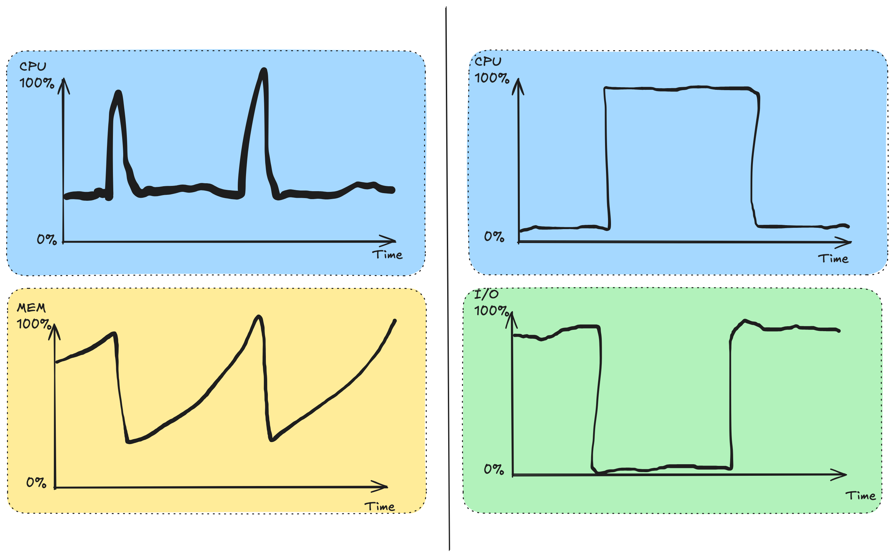

# Cloud Cost Optimization 
###  Marius Nygård 
Platform Engineer/DevOps Engineer @Crayon Consulting

1

<!-- HTML comment recognizes as a presenter note per pages. -->
<!-- You may place multiple comments in a single page. -->
---

# Problem Context

  

  ## The Cloud Cost Challenge
  - Cloud spending continues to grow at 20%+ annually
  - 30% of cloud spend is wasted on average
  - Instance selection directly impacts both performance and cost
  - Optimization requires deep understanding of workload patterns

  

  

  ## Prerequisites for Optimization
  - Ability to change instance types:
    - Auto scaling groups
    - Kubernetes workloads
    - Managed services
  - HA workloads enabling experimentation
  - Access to telemetry data

  
  

2

---

# Why Is picking the right instance type a problem?
Just to get an idea of the problem from a developer perspective:

  

  - Multiple cloud providers
  - Hundreds of instance types
  - Different CPU generations
  - Various memory configurations

  

  

  - Different pricing models (reserved/spot/on-demand)
  - Regional price variations
  - Regional instance availability

  
  

 
 
And all of this assumes you already have a good idea of what you need.
And your workload might change character over time.
Plus it changes all the time.

3

---
 
<video style="object-fit: cover;" src="./Screen Recording 2025-03-22 at 18.18.52.mov" width="500px"  controls></video>

4

---

# Goal 
Given that we have a lot of expensive workloads in the cloud, how can we think about cost optimization and what are the main levers we can utilize?

This talk will focus on the following:
- Finding good metrics and thinking through how to optimize for them
- How to gain insights into how different instance types perform for different workloads
- How to use telemetry to get insights into our workloads
  - And specifically what metrics are the most relevant for choosing the right instance

5

---

# Agenda

1. Understanding Cost Profiles: Metrics that matter
2. Workload Analysis: Using DAGs to identify bottlenecks
3. Evaluation Methods: Building a performance database
4. Case Study: Crayon/AMD optimization project
5. Actionable Takeaways: Steps you can implement today

6

---

  <h1>Section 1: Understanding Cost Profiles</h1>

7

---

<h2> Why is understanding the cost profile of your workload difficult?  </h2>

  

  ## Key Metrics Challenges
  - CPU utilization doesn't tell the whole story
  - Memory usage patterns vary widely
  - I/O bottlenecks often hidden
  - Network constraints unpredictable

  ## Workload Types Complexity
  - Batch jobs: Completion time vs. resource usage
  - Microservices: Complex dependencies
  - Data processing: Spiky resource demands
  - Stateful workloads: Different scaling rules

  

  

  ## Load Pattern Variables  
  - Constant load: Steady, predictable but inefficient
  - Diurnal patterns: Daily/weekly cycles
  - Spiky traffic: Hard to provision efficiently
  - Seasonal variations: Holiday traffic

  ## Optimization Focus Areas
  - Instance selection: Highest ROI for many workloads
  - Architecture: Biggest long-term impact
  - Auto-scaling policies: Balancing performance vs cost
  - Data storage choices: Often overlooked cost driver

  
  

8

---
 

9

---
 

10

---

# How to turn this into a tractable problem?

  

  ## Metric Approach
  - Our ultimate metric is **money**
  - We can proxy this with **time**
  - Finding cost: time × cost per resource unit
  - Example: $0.05/CPU-hour × 10 hours = $0.50

  ## Efficiency Analysis  
  - Instance utilization metrics reveal waste
  - Underutilized instances = wasted resources
  - Overloaded instances = performance issues
  - Target: optimal resource utilization

  

  

  ## Performance Profiling
  - CPU utilization patterns
  - Memory consumption trends
  - I/O bottlenecks
  - Network throughput
  
  ## Cost Evaluation Framework
  - Current state assessment
  - Performance-to-cost ratio
  - Instance rightsizing opportunity
  - Scaling policy optimization

  
  

11

---

# Core concepts

  

  ## Cost Components
  - Compute: Time × hourly instance cost
  - Network: Ingress/egress traffic charges
  - Storage: Capacity and operation costs
  - Managed services: Usage-based pricing

  ## Proxy Metrics
  - Transaction throughput rate
  - Requests processed per second
  - Data processed per dollar
  - Time-to-completion for batch jobs

  

  

  ## Hidden Costs
  - Developer time for optimization
  - Operational complexity
  - Troubleshooting overhead
  - Cloud architecture expertise
  - Application refactoring

  ## Price Variability
  - Reserved: 30-60% discount with commitment
  - Spot: 70-90% discount with availability risk
  - On-demand: Premium for flexibility
  - Regional price differences: up to 40%

  
  

12

---

  <h1>Section 2: Workload Analysis with DAGs</h1>

13

---

# Understanding Your Workload DAG

My preferred way to think about this is to break down your workload into a Directed Acyclic Graph (DAG)

- A DAG represents your workload as a series of connected operations
- Each node represents a processing step
- Edges represent dependencies or data transfer between steps
- Critical path represents the longest sequence that determines overall completion time
- And by adding a time metric to each node you get a overview of where the cost is

14

---

  

    Example: Simple Data Processing DAG

  

  
 

  

    Example: Microservice Architecture DAG

  

15

---

# Example: Cost Optimization with DAG Analysis
This becomes a longest path problem, which for a DAG can be solved with shortest path algorithms
need single unit of cost for each node (f(time, instance cost,num instances)->cost or f(data transfer)->cost)

16

---

# How to convert storage and CPU nodes to cost?

 
graph TD 
    Storage[Storage] --> CPU[CPU]
    CPU[CPU] --> Network[Network]
    Network[Network] --> GPU[GPU]
    GPU[GPU] --> Storage[Storage]

 
graph TD 
    Storage[100GB] --> CPU[m5.large 10 minutes]
    CPU --> Network[100MB/s]
    Network --> GPU[p4d.24xlarge, 10 minutes]
    GPU --> Storage[100GB]

  

17

---

# Optimizing Based on DAG Analysis

  

  ## Identify Critical Paths
  - Measure time at each node
  - Focus optimization on slowest paths
  - Calculate time × cost for each component
  - Analyze resource utilization per node

  ## Right-sizing Strategies
  - Compute-intensive nodes → CPU optimized
  - Memory-heavy nodes → Memory optimized
  - I/O bound nodes → Storage optimized
  - Network bottlenecks → Enhanced networking

  

  

  ## Scaling Considerations
  - Horizontal vs vertical scaling per node
  - Parallel execution opportunities
  - Queue-based decoupling
  - Caching strategies
  - Batch size optimization

  
  

18

---

# How to think about cost optimization

  

  ## Holistic Approach
  - End-to-end processing time you **paid for**
  - Data loading → Processing → Storage
  - Measure time at each DAG node
  - Identify bottlenecks in the workflow

  ## Optimization Principles
  - Focus on critical path components
  - Balance instance cost vs. performance
  - Consider scaling characteristics
  - Account for regional variations
  - Evaluate reserved/spot opportunities

  

  

  ## Real-world Considerations
  - Deployment complexity tradeoffs
  - Operational overhead
  - Reliability requirements
  - Data transfer costs

  ## Long-term Strategies
  - Regular instance type evaluation
  - Workload-specific benchmarking
  - Reserved instances for stable loads
  - Spot instances for flexible workloads
  - Architecture evolution planning

  
  

19

---

# Over provisioning is not inherently bad

  

  ## Balancing Tradeoffs
  - Robustness vs. efficiency
  - Performance predictability 
  - Buffer for unexpected spikes
  - Insurance against cascading failures

  ## Strategic Overprovisioning
  - Critical system components
  - Hard-to-scale bottlenecks
  - Customer-facing services
  - Data consistency components

  

  

  ## Cost of Underprovisioning
  - Lost transactions
  - Customer experience impact
  - Cascading system failures
  - Recovery resource needs
  - Business reputation damage
  
  

20

---

  <h1>Section 3: Building a Performance Database</h1>

21

---

<h2> How to learn about the performance of different instance types </h2>

  

  ## Performance Database
  - Built database of workload performance profiles
  - Covers major cloud providers and instance types
  - Normalized performance metrics
  - Historical performance tracking

  

  

  ## Key Profiling Components
  - Micro-benchmarks per CPU type
  - Time-to-completion measurements
  - Throughput per time unit
  - Cost efficiency conversion

  
  

22

---

# Performance Evaluation Methods

  

  ## Benchmark Suite Examples
  - SPECcpu: CPU-intensive workloads
  - FFmpeg: Video transcoding performance
  - Nginx: Web server throughput
  - Redis: In-memory data store

  

  

  ## Instance Categories
  - Compute-optimized
  - Memory-optimized
  - General purpose
  - GPU/specialized compute
  - ARM vs. x86 architecture

  
  

We essentially need to learn what is the best performance per dollar for each instance category

23

---

  <h1>Section 4: Case Study</h1>

24

---

# The Crayon-AMD Optimization Project

  

  ## Project Background
  - Partnership between Crayon and AMD
  - Goal: Give third party verification of AMD performance claims
  - Goal: Build up a performance database for all instances types
  - Focus on enterprise and cloud-native applications

  ## Technical Approach
  - Performance benchmarking across instance families
  - Workload profiling and classification
  - Migration path development
  - Cost-benefit analysis framework

  

  

  ## Partner Ecosystem
  - AWS (MA program integration)
  - Red Hat (OpenShift optimization)
  - VMware (Hybrid cloud scenarios)
  - Looking into integrating with AWS MAP and others

  
  

25

---

  <h1>Section 5: Actionable Takeaways</h1>

26

---

# Actionable Takeaways

  

  ## Immediate Steps
  - Build up a DAG analysis for your workloads
  - Implement basic telemetry if missing
  - Create performance/cost baselines
  - Identify quick-win instance changes
  - Use spot instances if you have the ability to do so

  

  

  ## Longer-term Actions
  - Build performance database for your workloads
  - Map workloads to optimal instance families
  - Implement auto-scaling policies based on telemetry
  - Develop cost allocation framework
  - Iterate on this so that you are adjusting as the environment changes

  
  

27

---

# Summary: Key Principles of Cloud Cost Optimization

- **Measure what matters**: Time × cost is your ultimate metric
- **Map your workloads**: DAG analysis reveals optimization opportunities
- **Profile performance**: Build instance type performance database
- **Target the critical path**: Focus on highest-impact components first
- **Balance efficiency and reliability**: Strategic overprovisioning where needed
- **Iterate continuously**: Cloud offerings and workloads change constantly

28

---

# Thank You!

Marius Nygård  
Platform Engineer/DevOps Engineer @Crayon Consulting
//TODO: add real email and linkedin
Contact: [marius.nygard@crayon.com](mailto:marius.nygard@crayon.com)  
LinkedIn: [linkedin.com/in/mariusnygard](https://linkedin.com/in/mariusnygard)

  <h3>Questions?</h3>

29

---

