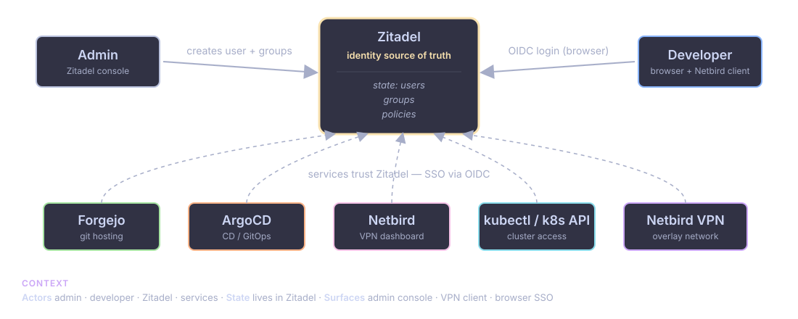
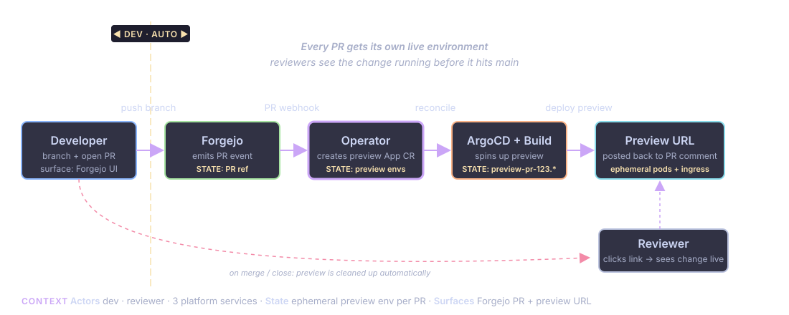
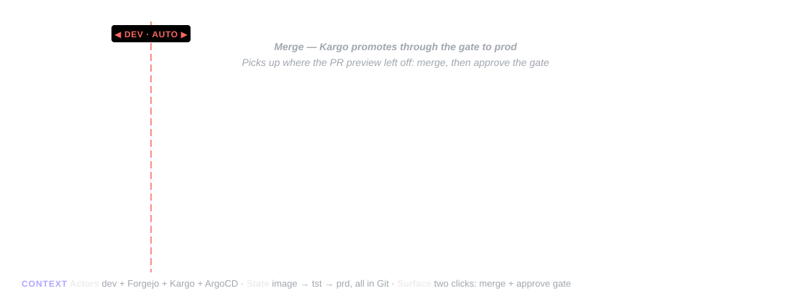

<!-- _class: lead -->
<!-- _paginate: false -->
<!-- _footer: "" -->

# The platform experience

## From zero to production in minutes

---

## Who am I?

- Marius — developer & platform engineer
- Part of a small team building an internal developer platform at our consultancy
- Today: showing you what it actually **feels like** to use this thing

---

## Where we are in the series

1. **BK** introduced internal developer platforms — the *why*
2. **Havard** showed the operator magic under the hood — the *how*
3. **Me** — tying it all together with a live demo — the *what it feels like*

> This presentation is all about the developer experience.

---

## Platform overview

Kubernetes at the core. GitOps everything.

- **ArgoCD** — CI/CD and GitOps
- **Zitadel** — identity & SSO (self-hosted, can federate Entra ID etc.)
- **Netbird** — self-hosted VPN for internal network access
- **Forgejo** — git hosting
- Supporting cast: Vault, Postgres operator, External DNS, Cert-manager, Dagger, Karpenter

---

## How it all fits together

- Tiny Terraform/Pulumi bootstrap to get the cluster up
- Everything else is GitOps from there — ArgoCD manages the full stack
- One identity provider (Zitadel) handles SSO across all services
- One VPN (Netbird) handles all internal access

> Coming soon: observability (Grafana), image updater, Kargo

---

<!-- _class: demo -->

## Onboarding a new developer

---

<!-- _class: demo -->

## Onboarding — the steps

1. Create a new user in Zitadel
2. User installs the Netbird VPN client
3. User logs in to the VPN
4. User can access all internal services — Forgejo, ArgoCD, Netbird dashboard — **all with SSO**
5. User can run `kubectl` against the cluster — same identity, one more command

> One identity, access to everything. Let's zoom in on that last step.

---

<!-- _class: demo -->

## `kubectl` access — one command

<object class="fragment-svg" type="image/svg+xml" data="diagrams/kubectl-auth.svg" style="width:950px;height:432px;"></object>

---

<!-- _class: demo dense -->

## `kubectl` — the steps

1. Run: `grove kubeconfig --merge --context-name dev`
   - Fetches the kubeconfig from the cluster over the VPN
   - Merges it into your existing `~/.kube/config`
2. Run `kubectl get ns`
   - First call opens a browser → Zitadel login → token cached locally
   - Subsequent calls are instant
3. The user's Zitadel groups become Kubernetes groups — same RBAC across the whole platform

> Nothing sensitive in shell history. Rotate the password in Zitadel and every kubectl session re-auths.

---

<!-- _class: demo -->

## Creating a new app

<object class="fragment-svg" type="image/svg+xml" data="diagrams/grove-register.svg" style="width:1000px;height:491px;"></object>

---

<!-- _class: demo -->

## New app — from scratch

1. Run the CLI: `grove init my-app`
2. CLI templates out a hello world app with everything you need:
   - Working web page
   - Dockerfile
   - CI pipeline config
   - Kubernetes manifests
3. Run: `grove register`
4. App is live — hello world running in prod

---

<!-- _class: demo -->

## New app — existing repo

1. Developer already has a local git repo with some code
2. Run the CLI: `grove register`
3. The operator kicks in:
   - Creates repo in Forgejo
   - Registers the app in ArgoCD
   - Kicks off the build pipeline
   - Deploys the app
4. App is running, accessible, deployed

---

<!-- _class: demo -->

## `grove register` — recording

<video controls src="demos/grove-register.mp4" style="max-width:1000px;max-height:500px;"></video>

---

<!-- _class: demo -->

## PR preview environments

---

<!-- _class: demo -->

## PR preview — recording

<video controls src="demos/pr-preview.mp4" style="max-width:1000px;max-height:500px;"></video>

---

<!-- _class: demo -->

## Pushing a feature to prod

---

<!-- _class: demo -->

## Push to prod — the steps

Once the PR looks good on the preview env:

1. Merge the PR — that's the only click the developer makes
2. Forgejo Actions runs post-merge — docker build + push image
3. ArgoCD sees the manifest update, syncs to cluster
4. Rolling update → new version live

> One click to merge. The rest is automatic.

---

<!-- _class: demo -->

## Push to prod — recording

<video controls src="demos/push-to-prod.mp4" style="max-width:1000px;max-height:500px;"></video>

---

## What we just saw

- **Onboarding** — new developer productive in minutes, not days
- **New app** — local repo to deployed app with one CLI command
- **Ship a feature** — `git push` and the platform does the rest
- Everything is GitOps. Everything is SSO. No tickets, no waiting.

---

## The relationship we're looking for

We work as an **enabling team** — not a product vendor.

- We bring a reference platform, not a product
- We pair with your existing or new internal platform team
- Together we implement and tune it to your stack, policies, and specific needs
- We transfer the reasoning, document the hard parts, and leave when your team owns it end-to-end

> Success: you end up with a platform that fits — and a team that doesn't need us.

---

<!-- _class: lead -->
<!-- _paginate: false -->
<!-- _footer: "" -->

# Thinking about building a platform?

## Already started and need help?

### Let's talk.

